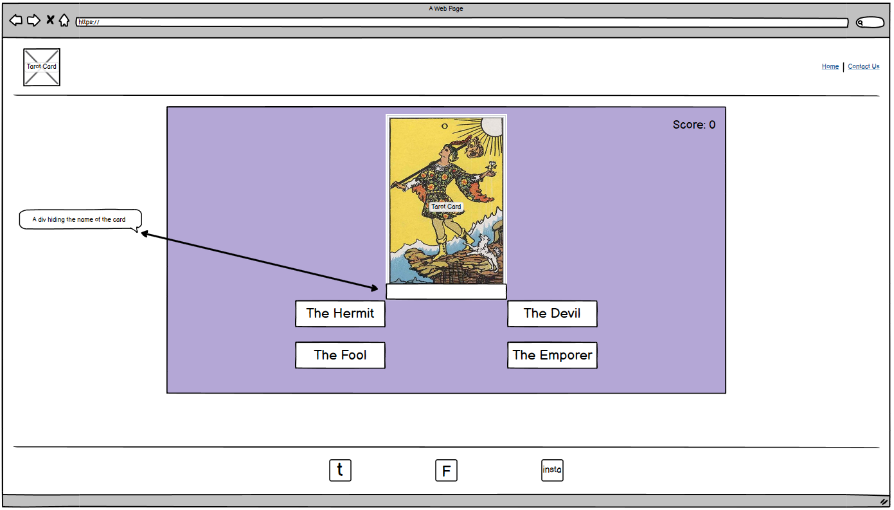
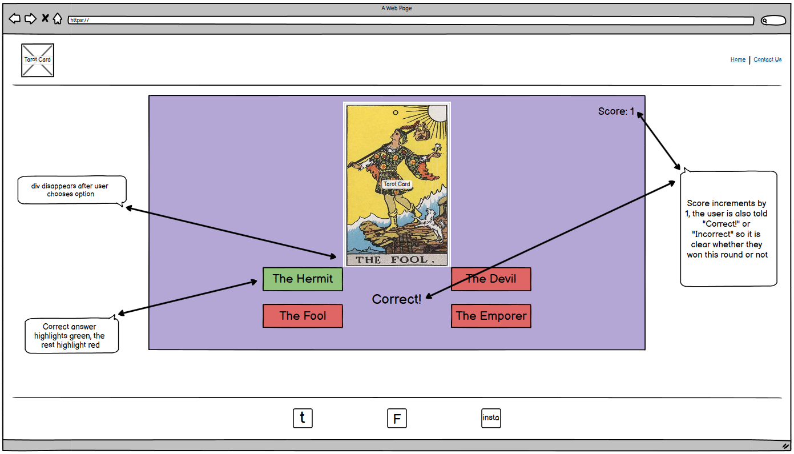
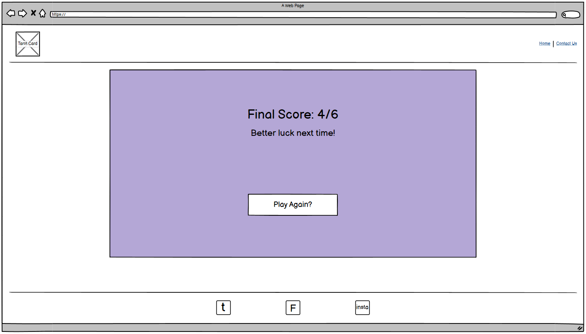
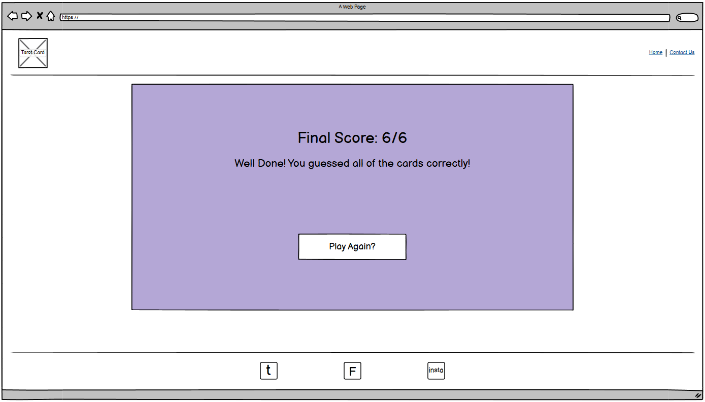
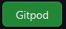

# Tarot Guesser

[Insert image of website mockup]

The Tarot Guesser game was designed in line with Code Institutes Project Portfolio 2's guidelines and aimed at people looking to play a fun game
of guessing which Tarot Card is which. This can be used as a fun and educational way to learn the Major Arcana of the vast Tarot deck.

The targets of this website and game were to be people who have a mild or major interest in the Tarot Deck and are looking for something fun to do relative to their 
interests. As an aside this can be used as an entertaining way to learn and stay fresh on the cards, their numbers, and depictions.

## Inception and Initial UX Goals/Designs
<hr>



To start with I knew I wanted some kind of guessing game. After speaking with my mentor we narrowed it down to a Tarot Guessing game that I had particular interest in because I just think they're visually descriptive enough to give a good guess as to what it is. I knew I wanted a main game area (purple) in which the card, questions and score would be located, in the center of the page.

I wanted the answers to be pre-determined, that way I could lay out a selection of answers that are plausible for the card "drawn" so to speak. I considered using photoshop to completely get rid of the cards name on the image, however decided hiding it with a div might be more fun, that way when the user guesses, the div can disappear and show them whether they were right or wrong.



When the user guesses correctly or incorrectly, I wanted the answer to be highlighted in green, and the wrong ones highlighted in red. The previously mentioned div would be removed to show the user what card it was, as well as an alert or text on the page telling them "Correct" or "Incorrect". Aside from this I wanted to keep a score, incrementing by 1 every time the user guesses correctly, and staying put if incorrect. I initially wanted 6 cards drawn randomly with the aim of getting all 6 correct to "Win" however decided on 7 later as it divides nicer in to the 21 Major Arcana of Tarot cards.



This was a simple mockup for if the user had gotten some guesses correct, showing their final score, but not all of the cards correct. The aim was to have them keep playing until they were familiar with the cards. The button "Play Again?" should bring you back to the main game to try again.



This was a mockup of the win screen, the user has gotten all 7 (6 during the time of making the mockup) cards correct and is congratulated for it. They are still asked if they would like to play again, to continue learning the cards.

The website areas of this mockup were generally not as important as the game mockup, however I figured a simple design with social links in the footer, an icon of a tarot card in the top left and maybe a home link so the user could bring themselves back to the first game state again would suffice.

## Deployment
<hr>

This website was deployed to GitHub pages. The link can be found here: (pages link here)

**To clone this repository:**

* Go to the top of the page and click "Fork" in the top right  
* Or by clicking "Code" at the top of the repository then copying the URL 
* Use ```git clone url``` in your Git Bash. 

**To deploy this site locally:** 

* Sign up to https://gitpod.io/ and install the extension for your browser. 
* After this is done you can click the "Gitpod" button at the top of this repository  
* This will automatically set up a new workspace for you.

**To deploy this site remotely:**

* From the project's [repository](https://github.com/mkenihandev/tarot-guesser), go to the Settings tab.
* From the left-hand menu, select the Pages tab.
* Under the Source section, select the Main branch from the drop-down menu and click Save.
* A message will be displayed to indicate a successful deployment to GitHub pages and provide the live link.

## Credits 
<hr>

**Content** 

* The template for the project was taken from Code Institutes Full Template
* The icons found throughout the website were taken from Font Awesome website

**Media**

* The images were initially taken from [VirgoGem on Pixabay](https://pixabay.com/users/virgogem-20272594/) as I needed royalty free images, however multiple were also 
taken from the [Major Arcana Wikipedia Page](https://en.wikipedia.org/wiki/Major_Arcana).