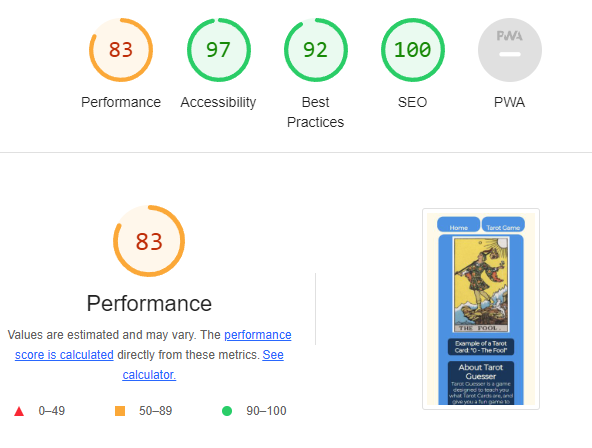

# Tarot Guesser Table of Contents

- [Tarot Guesser](#tarot-guesser)

- [Initial UX Goals and Designs](#initial-ux-goals-and-designs)

- [Features of the Website](#features-of-the-website)

- [Testing and Bug Solving](#testing-and-bug-solving)

- [Deployment](#deployment)

- [Credits](#credits)

# Tarot Guesser


The Tarot Guesser game was designed in line with Code Institutes Project Portfolio 2's guidelines and aimed at people looking to play a fun game
of guessing which Tarot Card is which. This can be used as a fun and educational way to learn the Major Arcana of the vast Tarot deck.

The targets of this website and game were to be people who have a mild or major interest in the Tarot Deck and are looking for something fun to do relative to their 
interests. As an aside this can be used as an entertaining way to learn and stay fresh on the cards, their numbers, and depictions.

## Initial UX Goals and Designs
<hr>


To start with I knew I wanted some kind of guessing game. After speaking with my mentor we narrowed it down to a Tarot Guessing game that I had particular interest in because I just think they're visually descriptive enough to give a good guess as to what it is. I knew I wanted a main game area (purple) in which the card, questions and score would be located, in the center of the page.

I wanted the answers to be pre-determined, that way I could lay out a selection of answers that are plausible for the card "drawn" so to speak. I considered using photoshop to completely get rid of the cards name on the image, however decided hiding it with a div might be more fun, that way when the user guesses, the div can disappear and show them whether they were right or wrong.


When the user guesses correctly or incorrectly, I wanted the answer to be highlighted in green, and the wrong ones highlighted in red. The previously mentioned div would be removed to show the user what card it was, as well as an alert or text on the page telling them "Correct" or "Incorrect". Aside from this I wanted to keep a score, incrementing by 1 every time the user guesses correctly, and staying put if incorrect. I initially wanted 6 cards drawn randomly with the aim of getting all 6 correct to "Win" however decided on 7 later as it divides nicer in to the 21 Major Arcana of Tarot cards.


This was a simple mockup for if the user had gotten some guesses correct, showing their final score, but not all of the cards correct. The aim was to have them keep playing until they were familiar with the cards. The button "Play Again?" should bring you back to the main game to try again.


This was a mockup of the win screen, the user has gotten all 7 (6 during the time of making the mockup) cards correct and is congratulated for it. They are still asked if they would like to play again, to continue learning the cards.


This mobile mockup was just to envision how I would go about laying out the question buttons on a mobile screen. I initially was going to keep them 2 x 2 but with some of the longer named cards it was easier to just display them vertically.

The website areas of this mockup were generally not as important as the game mockup, however I figured a simple design with social links in the footer, an icon of a tarot card in the top left and maybe a home link so the user could bring themselves back to the first game state again would suffice.

## Features of the Website
<hr>

* **Navigation Bar**

    * The Navbar is simple and holds two links, one to the index page and another to the game.
    * The Navbar changes when you are currently on the game page, and instead says "Reset" instead of "Tarot Game". It still functions the exact same, however alerts the user to another functionality of refreshing the page, which is resetting the game.


Navbar while on the landing page


Navbar while on the game page

* **Landing Page**

    * The Landing Page is host to two different pieces. First being the information about the website and the second is an example of a Tarot Card.
    * The information tells the user what the website is about, the rules of the game and what a Tarot Card actually is.
    * The example image of a Tarot Card gives the user a chance to learn what a Tarot Card looks like, and how it is laid out between the roman numeral of the card and the name itself.

 

* **Game Page**

    * The Game Page is the main focus of the website. It is host to many features including but not limited to a dynamic cover so the user cannot just read the card name until they have guessed to an ending screen which gives the user a win or loss based on their score.
    * The first thing a user will see is the randomly chosen card, the cover, and four buttons each with an answer chosen by me to not be too "obvious".
    * After clicking an answer button, the user will see the cover disappear, revealing their card. It will tell the user below whether they got the answer right or wrong, and tell them again what the card is. The last thing they will see is a "Next Card" button, which loads up our next round, giving the user another random card.
    * The score located below the card will increment every time a user gets an answer correct. As stated in the rules of the first page, you only get 7 tries so the user has to make them count. It is designed so someone new to the cards will likely not win the first time, and be eager to play again to learn more.
    * After a user makes 7 guesses, whether they are right or wrong, all of the features of the game page are hidden, and replaced with a win condition end screen.
    * If a player has won, they get a congratulatory screen telling them they got everything correct.
    * However, if a player loses, they will receive an encouraging end screen prompting them to play again.
    * Regardless of a win or loss, the player will see a "Play Again?" button at the bottom of their screen, which will completely reset the game and run it again.

  


## Testing and Bug Solving
<hr>

* **Bugs I solved** 
    * Going through the JavaScript code with my mentor we realized the function responsible for incrementing the score had reduntant code for adding the score and counter
        * Solved by simply removing the redundant code and moving it appropriately to its own function

    * There were a lot of repeat functions with essentially the exact same code, designed to display X cards questions.
        * Fixed by creating a "displayQuestions" functions that simply takes the parameters of the card instead

    * Upon testing the responsiveness of the site, I noticed on a game win/loss the "Next Card" button and "Play again" button were still displaying when only the "Play again" button should have been. This was due to the fact the "Next Card" button is never actually hidden on a game win/loss, it is simply overlapped by "Play again".
        * Solved by adding an entry to remove the "Next Card" button on the end screen function.

    * The game section of the website was displaying incorrectly on other browsers (Safari, Chrome), buttons were hanging way outside the game area and more
        * Solved by discovering "grid-row" instead of "grid-template-rows" in the responsive styling, Firefox was displaying correctly despite this so it went undiscovered for a while.

* **Browser Testing and User Stories**


* **Validation Testing**

    * HTML
        * There were no errors when validated on [W3C Validator](https://validator.w3.org/nu/?doc=https%3A%2F%2Fmkenihandev.github.io%2Ftarot-guesser%2F)

    * CSS
        * There were no errors when passed through the [Jigsaw W3C Validation Service](https://jigsaw.w3.org/css-validator/validator?uri=https%3A%2F%2Fmkenihandev.github.io%2Ftarot-guesser%2F&profile=css3svg&usermedium=all&warning=1&vextwarning=&lang=en)

    * JS
        * There were warnings with the JavaScript when passed through JShint, however most were "x is available in ES6" and "template literal syntax is only available in ES6".

    * Accessibility 
        * The site was run through both desktop and mobile Lighthouse and scored above 90 in every section except for performance on mobile.
        * My assumption is that this is because of the amount of images saved as .PNG so in the future I would like to lower the performance cost of my website.

    

    

## Deployment
<hr>

This website was deployed to GitHub pages. The link can be found here: (pages link here)

**To clone this repository:**

* Go to the top of the page and click "Fork" in the top right  
* Or by clicking "Code" at the top of the repository then copying the URL 
* Use ```git clone url``` in your Git Bash. 

**To deploy this site locally:** 

* Sign up to https://gitpod.io/ and install the extension for your browser. 
* After this is done you can click the "Gitpod" button at the top of this repository  
* This will automatically set up a new workspace for you.

**To deploy this site remotely:**

* From the project's [repository](https://github.com/mkenihandev/tarot-guesser), go to the Settings tab.
* From the left-hand menu, select the Pages tab.
* Under the Source section, select the Main branch from the drop-down menu and click Save.
* A message will be displayed to indicate a successful deployment to GitHub pages and provide the live link.

## Credits 
<hr>

**Content** 

* The template for the project was taken from Code Institutes Full Template
* The icons found throughout the website were taken from Font Awesome website

**Media**

* The images were initially taken from [VirgoGem on Pixabay](https://pixabay.com/users/virgogem-20272594/) as I needed royalty free images, however multiple were also 
taken from the [Major Arcana Wikipedia Page](https://en.wikipedia.org/wiki/Major_Arcana).